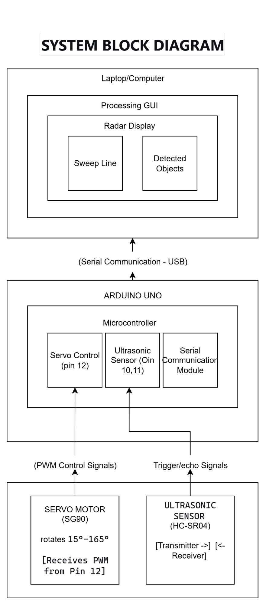
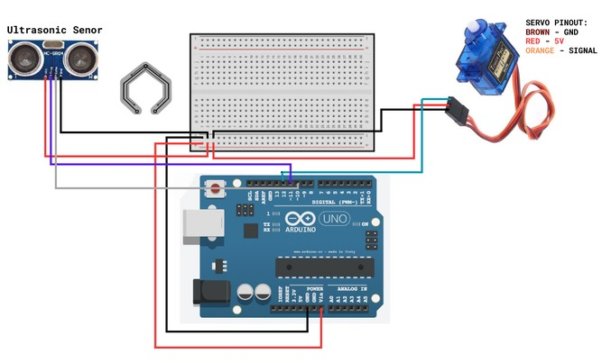
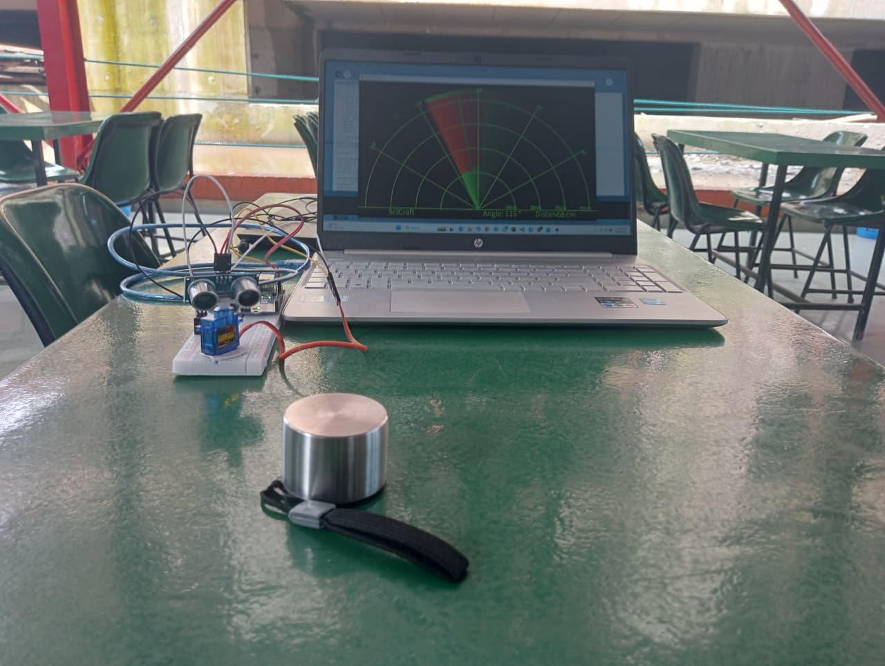

# Smart Radar System  
**CSC 330 - Logic Design and Switching Circuit Lab, IUBAT**  
**Team D: Md. Fardin Al Shafik, Robiul Islam, A.K.M Ashraful Hoque, Hasan Bin Imran, Md. Samiul Islam**  
Instructor: Md. Asif Hossain

---

**Smart Radar System for Logic Design (CSC 330) at IUBAT. Uses Arduino Uno, SG90 servo, HC-SR04 sensor, and Processing for real-time object detection and radar visualization—integrating digital circuit design with embedded, interactive hardware.**

---

## 🚀 Key Images

**System Block Diagram**  

**Wiring Diagram of the Smart Radar System**  

**Screenshot of Processing GUI**  

---

## 📁 Repository Structure

- **/code**
  - `radar.ino` — Arduino sketch for servo and sensor control  
  - `radar.pde` — Processing sketch for data visualization

- **/images**
  - `1.png` — System Block Diagram  
  - `2.jpg` — Wiring Diagram of the Smart Radar System  
  - `3.jpg` — Screenshot of Processing GUI

- **/report**
  - [`CSC 330 Project Report (3).pdf`](report/CSC%20330%20Project%20Report%20(3).pdf) — Complete project documentation

---

## 🔧 Quick Start

1. **Hardware Setup:**  
   - Follow the wiring diagram above to assemble all components.

2. **Upload Arduino Code:**  
   - Open `/code/radar.ino` in the Arduino IDE and upload to your Arduino Uno.

3. **Run Processing Visualization:**  
   - Open `/code/radar.pde` in Processing IDE.  
   - Change the serial port setting if needed.  
   - Run the sketch to see the radar sweep in action.

4. **Details and Analysis:**  
   - See the full [`CSC 330 Project Report (3).pdf`](report/CSC%20330%20Project%20Report%20(3).pdf) for methodology, design, and results.

---

## 📚 References

- [SciCraft DIY Radar Tutorial](https://youtu.be/SvLObGL-5ZY?si=bGfAhaNbuGm9a0br)
- [Arduino Uno Documentation](https://store.arduino.cc/products/arduino-uno-rev3)
- [HC-SR04 Sensor Tutorial](https://www.arduino.cc/en/Tutorial/UltrasonicSensor)
- [Processing IDE](https://processing.org/)
- [SG90 Micro Servo Info](https://www.servocity.com/sg90-micro-servo)

---

*For queries or collaboration, contact the project team. This repository fulfills the academic requirements for CSC 330 at IUBAT.*
